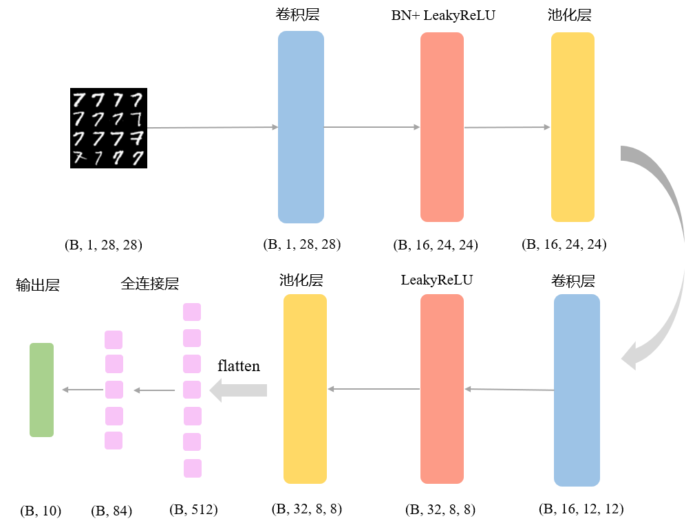

# MINIST-Classifier

卷积神经网络实现手写数字识别




## 项目结构

```bash
----MINIST-classifier\
    |----config\     配置文件目录
    |    |----config.yaml
    |----dataset\    数据集目录
    |    |----MNIST\
    |    |    |----raw\
    |    |    |    |----t10k-images-idx3-ubyte
    |    |    |    |----t10k-labels-idx1-ubyte
    |    |    |    |----train-images-idx3-ubyte
    |    |    |    |----train-labels-idx1-ubyte
    |----metrics.py  评测指标计算
    |----ml_test.py  不同模型的对比实验
    |----network.py  网络定义
    |----README.md 
    |----requirements.txt  环境需求文件
    |----result\     实验结果
    |----run\        tensorboardX训练loss/acc可视化
    |----script.bat  批量训练脚本
    |----train.py    模型训练
    |----val.py      模型预测
    |----weight.pkl  模型权重
```

## TODO

- [x] 基于PyTorch深度学习框架，搭建多层卷积神经网络
- [x] 实现手写数字识别，采用precision、recall和F1-score评测模型表现
- [x] 调整不同学习率和优化器，对比模型表现
- [x] 对比不同模型，分析模型优缺点
- [ ] 更多的对比实验组，更友好的图形化操作界面
- [ ] ...

## Setup

```bash
pip install -r requirements.txt
```

## Train

可以通过GPU和CPU来进行训练，本机CUDA版本为10.2，为防止出现环境问题，建议使用**CPU**来进行训练

1. **命令行参数启动训练**

```bash
# 指定参数运行示例
python train.py 
	--data_path ./dataset
	--epochs 10 
	--batch_size 64 
	--learning_rate 0.001 
	--optimizer Adam
	
# 默认配置运行示例
python train.py
```

2. **配置文件方式启动训练**

```bash
# yaml配置文件并放置在指定目录下
CONF_PATH='./config/config.yaml'

# yaml文件内容
data_path: './dataset/'
epochs: 10
batch_size: 64
learning_rate: 0.001
optimizer: Adam
weight: './weight.pkl'

# 启动训练
python train.py --cfg ./config/config.yaml
```

3. **script批量训练**

```bash
# script.bat
python train.py --data_path ./dataset --epochs 10 --batch_size 64 --learning_rate 0.001 --optimizer SGD
python train.py --data_path ./dataset --epochs 10 --batch_size 64 --learning_rate 0.001 --optimizer Momentum
python train.py --data_path ./dataset --epochs 10 --batch_size 64 --learning_rate 0.001 --optimizer NAG
python train.py --data_path ./dataset --epochs 10 --batch_size 64 --learning_rate 0.001 --optimizer AdaGrad
python train.py --data_path ./dataset --epochs 10 --batch_size 64 --learning_rate 0.001 --optimizer RMSProp
python train.py --data_path ./dataset --epochs 10 --batch_size 64 --learning_rate 0.001 --optimizer Adam
python train.py --data_path ./dataset --epochs 10 --batch_size 64 --learning_rate 0.001 --optimizer NAdam
```


## Predict

可以直接通过提供的权重文件weight.pkl对测试集进行预测，需要用**CPU**来运行

1. **命令行参数进行预测**

```bash
# 指定参数运行示例
python val.py 
	--data_path ./dataset 
    --weight ./weight.pkl
    
# 默认配置运行示例
python val.py
```

2. **命令行参数进行预测**

```bash
python val.py --cfg ./config/config.yaml
```


## Result

详见报告对比实验部分

